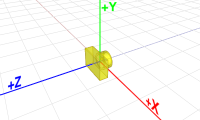
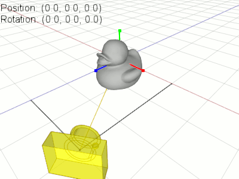
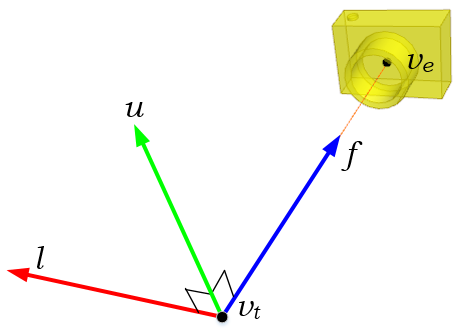

# Function_Look_At

在opengl中，对于相机对象和关于相机变换的特殊矩阵并没有明确的定义。而是将整个场景（包括相机）***逆旋转***至一个空间中。

我们将面向-z轴且在原点(0,0,0)的相机所在的空间称为**eye space**。

相机的look_at( or $M_{view}$ )变换由平移矩阵和旋转矩阵组成。
1. 通过 $M_T$ 将整个场景从eye position平移到原点。
2. 通过 $M_R$ 将场景旋转，使得相机位于原点且面向-z轴

**平移矩阵**

假设我们的eye position在 ( $x_e, y_e, z_e$ ) ，则 $M_T$ 为：

$$
M_T=
\begin{bmatrix}
 1 & 0 & 0 & -x_e\\
 0 & 1 & 0 & -y_e\\
 0 & 0 & 1 & -z_e\\
 0 & 0 & 0 & 1
\end{bmatrix}
$$

**旋转矩阵**

对于旋转矩阵相对来说有一点困难。需要计算前三列的相关数据。

首先，我们需要计算从eye position ( $v_e$ ) 到target position ( $v_t$ ) 的归一化前向向量 $f$ 。即：

$$
f = \frac{v_e - v_t}{||v_e - v_t||}
$$

其次，通过前向向量 $f$ 和相机提供的上向向量 $up$ 进行叉乘，计算出归一化左向向量 $l$ ：

$$
l = \frac{up \times f}{||up \times f||}
$$

然后重新计算归一化上向向量 $u$ ：

$$
u = f \times l
$$

通过 $f, u, l$ 向量，我们组成一个临时的矩阵 $M_{Rtemp}$ ：

$$
M_{Rtemp} =
\begin{bmatrix}
l_x & u_x & f_x & 0\\
l_y & u_y & f_y & 0\\
l_z & u_z & f_z & 0\\
0 & 0 & 0 & 1
\end{bmatrix}
$$

该矩阵阐述了以相机为原点，目标所在的位置。为了使相机能够面向-z轴，我们需要将场景进行逆旋转(inverse rotation)。
所以我们需要求解 $M_{Rtemp}$ 矩阵的逆。又因为该矩阵是正交矩阵，所以：

$$
M_R = M_{Rtemp}^{-1} = M_{Rtemp}^{T} = 
\begin{bmatrix}
l_x & l_y & l_z & 0\\
u_x & u_y & u_z & 0\\
f_x & f_y & f_z & 0\\
0 & 0 & 0 & 1
\end{bmatrix}
$$

最后将 $M_T$ 与 $M_R$ 相乘得：

$$
M_{view} = M_RM_T =
\begin{bmatrix}
l_x & l_y & l_z & 0\\
u_x & u_y & u_z & 0\\
f_x & f_y & f_z & 0\\
0 & 0 & 0 & 1
\end{bmatrix}
\begin{bmatrix}
 1 & 0 & 0 & -x_e\\
 0 & 1 & 0 & -y_e\\
 0 & 0 & 1 & -z_e\\
 0 & 0 & 0 & 1
\end{bmatrix} =
\begin{bmatrix}
l_x & l_y & l_z & -l_xx_e - l_yy_e - l_zz_e\\
u_x & u_y & u_z & -u_xx_e - u_yy_e - u_zz_e\\
f_x & f_y & f_z & -f_xx_e - f_yy_e - f_zz_e\\
0 & 0 & 0 & 1
\end{bmatrix}
$$

