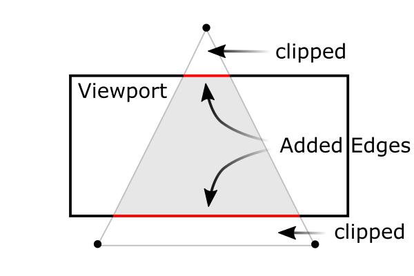
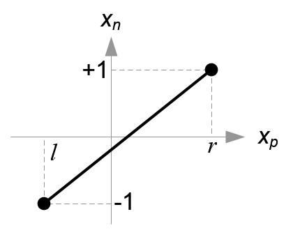
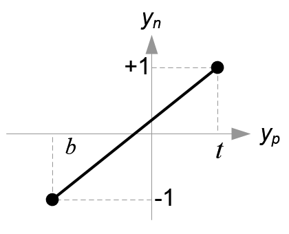

# Function_Perspective

电脑的屏幕是一个2D平面，所以我们需要将3D场景投影在2D平面上。

在做透视投影(perspective projection)变换之前，我们需要将场景在裁剪坐标系中进行裁剪(frustum culling)。
裁剪坐标系需要通过除以一个裁剪坐标系的分量 $w$ 变换成归一化设备坐标系(NDC, normalized device coordinates)。

将所有顶点(vertex)与 $w_c$ 进行比较：

$$
-w_c \lt x_c,y_c,z_c \lt w_c
$$

将所有不在范围内的顶点变为不可见。

在**透视投影**中，我们需要将eye coordinates下的截棱锥映射成一个NDC正方体(cube)。

> 注意：eye coordinates下，我们使用的是右手坐标系，而NDC下我们使用左手坐标系。

 

在俯视图中我们可以看到， $x_e$ 通过**相似三角形**被映射成了 $x_p$ 。即：

$$
\begin{align*}
\frac{x_p}{x_e} &= \frac{-n}{z_e} \\
x_p &= \frac{-n \cdot x_e}{z_e} = \frac{n \cdot x_e}{-z_e}
\end{align*}
$$

在侧视图中，我们依然可以通过**相似三角形**来计算 $y_p$ ：

$$
\begin{align*}
\frac{y_p}{y_e} &= \frac{-n}{z_e}\\
y_p &= \frac{-n \cdot y_e}{z_e} = \frac{n \cdot y_e}{-z_e}
\end{align*}
$$

通过观察公式，发现 $x_p$ 和 $y_p$ 都是与 $-z_e$ 成反比例。(后面构造投影矩阵(projection matrix)会有帮助)

我们暂时能将变换过程通过矩阵的方式写出来：

$$
\begin{bmatrix}
x_{clip}\\
y_{clip}\\
z_{clip}\\
w_{clip}
\end{bmatrix} = 
M_{projection} \cdot
\begin{bmatrix}
x_{eye}\\
y_{eye}\\
z_{eye}\\
w_{eye}
\end{bmatrix},
\begin{bmatrix}
x_{ndc}\\
y_{ndc}\\
z_{ndc}
\end{bmatrix} = 
\begin{bmatrix}
x_{clip} / w_{clip}\\
y_{clip} / w_{clip}\\
z_{clip} / w_{clip}
\end{bmatrix}
$$

因此我们可以暂时将投影矩阵的第4行(4th row)写出来：

$$
\begin{align*}
&\because
\begin{bmatrix}
x_c\\
y_c\\
z_c\\
w_c
\end{bmatrix} =
\begin{bmatrix}
\cdot & \cdot & \cdot & \cdot\\
\cdot & \cdot & \cdot & \cdot\\
\cdot & \cdot & \cdot & \cdot\\
0 & 0 & -1 & 0\\
\end{bmatrix}
\begin{bmatrix}
x_e\\
y_e\\
z_e\\
w_e\\
\end{bmatrix}\\\\
&\therefore
w_c = -z_e
\end{align*}
$$

现在，我们需要将 $x_p$ 和 $y_p$ 映射到NDC中的 $x_n$ 和 $y_n$，线性关系为: $[l,r]\Rightarrow[-1,1]$ 和 $[b,t]\Rightarrow[-1,1]$ 。

$$
\begin{align*}
x_n &= \frac{1-(-1)}{r-l} \cdot x_p + \beta\\
1 &= \frac{2r}{r-l} + \beta &\text{(subsitute $(r,l)$ for $(x_p, x_n)$ )}\\
\beta &= 1-\frac{2r}{r-l} = \frac{r-l}{r-l} - \frac{2r}{r-l}\\
&= \frac{r-l-2r}{r-l} = \frac{-r-l}{r-l} = -\frac{r+l}{r-l}\\
\therefore x_n &= \frac{2x_p}{r-l} - \frac{r+l}{r-l}
\end{align*}
$$

$$
\begin{align*}
y_n &= \frac{1-(-1)}{t-b} \cdot y_p + \beta\\
1 &= \frac{2t}{t-b} + \beta &\text{(subsitute $(t, 1)$ for $(y_p, y_n)$ )}\\
\beta &= 1-\frac{2t}{t-b} = \frac{t-b}{t-b} - \frac{2t}{t-b}\\
&= \frac{t-b-2t}{t-b} = \frac{-t-b}{t-b} = -\frac{t+b}{t-b}\\
\therefore y_n &= \frac{2y_p}{t-b} - \frac{t+b}{t-b}
\end{align*}
$$

然后我们将 $x_p$ 和 $y_p$ 带入上述式子中，化简得：

$$
\begin{align*}
x_n &= \frac{2x_p}{r-l} - \frac{r+l}{r-l} &\text{( $x_p = \frac{nx_e}{-z_e}$ )}\\
&= (\underset{x_c}{\underbrace{\frac{2n}{r-l} \cdot x_e + \frac{r+l}{r-l} \cdot z_e}})/ -z_e\\\\
y_n &= \frac{2y_p}{t-b} - \frac{t+b}{t-b} &\text{( $y_p = \frac{ny_e}{-z_e}$ )}\\
&= (\underset{y_c}{\underbrace{\frac{2n}{t-b} \cdot y_e + \frac{t+b}{t-b} \cdot z_e}})/ -z_e
\end{align*}
$$

通过上述的式子，我们又可以丰富我们的投影矩阵：

$$
\begin{bmatrix}
x_c\\
y_c\\
z_c\\
w_c\\
\end{bmatrix} =
\begin{bmatrix}
\frac{2n}{r-l} & 0 & \frac{r+l}{r-l} & 0\\
0 & \frac{2n}{t-b} & \frac{t+b}{t-b} & 0\\
\cdot & \cdot & \cdot & \cdot\\
0 & 0 & -1 & 0\\
\end{bmatrix}
\begin{bmatrix}
x_e\\
y_e\\
z_e\\
w_e\\
\end{bmatrix}
$$

$z_n$ 的值与上述方法不同，因为 $z_e$ 总是从eye space投影到 $-n$ 的近平面(near plane)。但是我们需要唯一确定 $z$ 的值，用来裁剪和深度测试。另外，我们应该可以对它进行逆变换。我们现在确定的是： $z$ 的值跟 $x,y$ 的值没有关系。所以我们可以将投影矩阵假设成：

$$
\begin{bmatrix}
x_c\\
y_c\\
z_c\\
w_c\\
\end{bmatrix} =
\begin{bmatrix}
\frac{2n}{r-l} & 0 & \frac{r+l}{r-l} & 0\\
0 & \frac{2n}{t-b} & \frac{t+b}{t-b} & 0\\
0 & 0 & A & B\\
0 & 0 & -1 & 0\\
\end{bmatrix}
\begin{bmatrix}
x_e\\
y_e\\
z_e\\
w_e\\
\end{bmatrix}, ~~~~z_n=z_c/w_c=\frac{Az_e+Bw_e}{-z_e}
$$

在eye space中， $w_e = 1$ ,所以：

$$
z_n=\frac{Az_e + B}{-z_e}
$$

通过映射关系( $z_e \Rightarrow z_n \rightarrow -n \Rightarrow -1 \rightarrow -f \Rightarrow 1$ )，我们可以列出下列式子：

$$
(z_e, z_n)\rightarrow (-n, 1)~\text{and}~(-f,1)
$$

$$
\begin{align*}
\begin{matrix}
\frac{-An+B}{n} = -1\\\\
\frac{-Af+B}{f} = 1
\end{matrix}
\rightarrow
\begin{matrix}
-An + B &= -n \\
-Af + B &= f
\end{matrix}
\end{align*}
$$

$$
\begin{align*}
\therefore~~~~~~~~~~~~~~~~~~~~
A &= -\frac{f+n}{f-n}\\
B &= -\frac{2fn}{f-n}
\end{align*}
$$

所以，最后透视投影矩阵变成了：

$$
\begin{bmatrix}
\frac{2n}{r-l} & 0 & \frac{r+l}{r-l} & 0\\
0 & \frac{2n}{t-b} & \frac{t+b}{t-b} & 0\\
0 & 0 & \frac{-(f+n)}{f-n} & -\frac{2fn}{f-n}\\
0 & 0 & -1 & 0\\
\end{bmatrix}
$$

这是一般情况下的透视投影矩阵，如果在观察体积对称的情况下，矩阵就可以简化成：

$$
\begin{align*}
r+l&=0\\
r-l&=2r~\text{(width)}
\end{align*}
$$

$$
\begin{align*}
t+b&=0\\
t-b&=2t~\text{(height)}
\end{align*}
$$

$$
\begin{align*}
\therefore
\begin{bmatrix}
\frac{n}{r} & 0 & 0 & 0\\
0 & \frac{n}{t} & 0 & 0\\
0 & 0 & \frac{-(f+n)}{f-n} & -\frac{2fn}{f-n}\\
0 & 0 & -1 & 0\\
\end{bmatrix}
\end{align*}
$$
