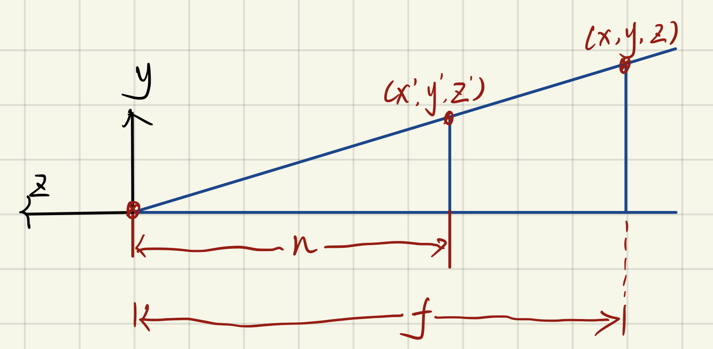

# Perspective Part.1

You should have known the [homogeneous coordinates](https://en.wikipedia.org/wiki/Homogeneous_coordinates)

Here we just provide a simple affine projection matrix, first:

## 3D affine transformations

$$
\begin{bmatrix}
 1 & 0 & 0 & 0\\
 0 & 1 & 0 & 0\\
 0 & 0 & 1 & 0\\
 0 & 0 & -1/c & 1
\end{bmatrix}
$$

note: the $c$ is a constant number.

## Perspective Projection Derivation

### Orthographic projection

First of all, move the object's center onto origin $(0,0,0)$ .

$$
M_{translate} = 
\begin{pmatrix}
1 & 0 & 0 & \frac{-(l+r)}{2}\\
0 & 1 & 0 & \frac{-(b+t)}{2}\\
0 & 0 & 1 & \frac{-(f+n)}{2}\\
0 & 0 & 0 & 1
\end{pmatrix}
$$

Then, normalize the object.

$$
M_{normalize} =
\begin{pmatrix}
\frac{2}{r-l} & 0 & 0 & 0\\
0 & \frac{2}{t-b} & 0 & 0\\
0 & 0 & \frac{2}{n-f} & 0\\
0 & 0 & 0 & 1
\end{pmatrix}
$$

And multiply them:

$$
M_{ortho} = M_{normalize} \cdot M_{translate}
$$

### Step into the deep.

Through observing the figure, we see that there is a similar triangle
and then:

$$
y'=\frac{n}{z}y
$$

Similarly:

$$
x'=\frac{n}{z}x
$$

Then we have a mapping matrix:

$$
\begin{pmatrix}
x\\
y\\
z\\
1
\end{pmatrix}\rightarrow
\begin{pmatrix}
\frac{n}{z}x\\
\frac{n}{z}y\\
\text{unknown}\\
1
\end{pmatrix}\rightarrow
\begin{pmatrix}
n & 0 & 0 & 0\\
0 & n & 0 & 0\\
? & ? & ? & ?\\
0 & 0 & 1 & 0
\end{pmatrix}\cdot
\begin{pmatrix}
x\\
y\\
z\\
1
\end{pmatrix}
$$

Here, we need know some rules:

1. Points of the near plane are constant.

2. The coordinates $(0, 0, f, 1)$ of the centric point of the far plane are unchanged.

3. The values of points' $z$ coordinate on the far plane are always $f$.

Because of **rule 3**, we can get a equaltion:

$$
\begin{pmatrix}
n & 0 & 0 & 0\\
0 & n & 0 & 0\\
? & ? & ? & ?\\
0 & 0 & 1 & 0\\
\end{pmatrix}\cdot
\begin{pmatrix}
x\\
y\\
n\\
1
\end{pmatrix}=
\begin{pmatrix}
nx\\
ny\\
n^2\\
n
\end{pmatrix}\underset{normalize}{=}
\begin{pmatrix}
x\\
y\\
n\\
1
\end{pmatrix}
$$

Suppose the thrid row of the above matrix are $(A, B, C, D)$ .
$$
\begin{align*}
\therefore
Ax + By + Cn + D = n^2
\end{align*}
$$

And, it's clear that

$$
A = 0\\
B=0
$$

Then we could get:

$$
Cn + D = n^2
\tag{1}
$$

According the **rule 2**, the coordinates of the centric point of the
far plane are $(0, 0, f, 1)$ .

Take it in the above matrix and get the following matrix;

$$
\begin{pmatrix}
n & 0 & 0 & 0\\
0 & n & 0 & 0\\
? & ? & ? & ?\\
0 & 0 & 1 & 0\\
\end{pmatrix}\cdot
\begin{pmatrix}
0\\
0\\
f\\
1
\end{pmatrix}=
\begin{pmatrix}
0\\
0\\
f^2\\
f
\end{pmatrix}\underset{normalize}{=}
\begin{pmatrix}
0\\
0\\
f\\
1
\end{pmatrix}
$$

Like the above equaltion, get the following equaltion:

$$
Cf+D = f^2
\tag{2}
$$

There are two equaltions with two varibles.

$$
\left\{\begin{matrix}
Cn+D = n^2\\
Cf+D =f^2
\end{matrix}\right.
\Rightarrow
\left\{\begin{matrix}
C = n+f\\
D = -nf
\end{matrix}\right.
$$

Finally, we get the perspective projection matrix:

$$
M_{persp} = M_{normalize} \cdot M_{translate} \cdot
\begin{pmatrix}
n & 0 & 0 & 0\\
0 & n & 0 & 0\\
0 & 0 & n+f & -nf\\
0 & 0 & 1 & 0
\end{pmatrix}
$$

## Rodrigoues' Rotation Formula

Rotation by angle $\alpha$ around axis $n$ .

$$
R(n,\alpha)=\cos(\alpha)I+(1-\cos(\alpha))nn^T
+\sin(\alpha)
\underset{N}{\underbrace{\begin{pmatrix}
0 & -n_z & n_y \\
n_z & 0 & -n_x \\
-n_y & n_x & 0
\end{pmatrix}}}
$$

## References
[GAMES101: P4 lecture Transformation Cont.](https://www.bilibili.com/video/BV1X7411F744/?p=4&vd_source=9b29fbb94899efe7f2ac4d639f48fbf3)

[GAMES101: 现代计算机图形学入门](https://sites.cs.ucsb.edu/~lingqi/teaching/games101.html)

[Perspective Projection Derivation](https://zhuanlan.zhihu.com/p/122411512)
