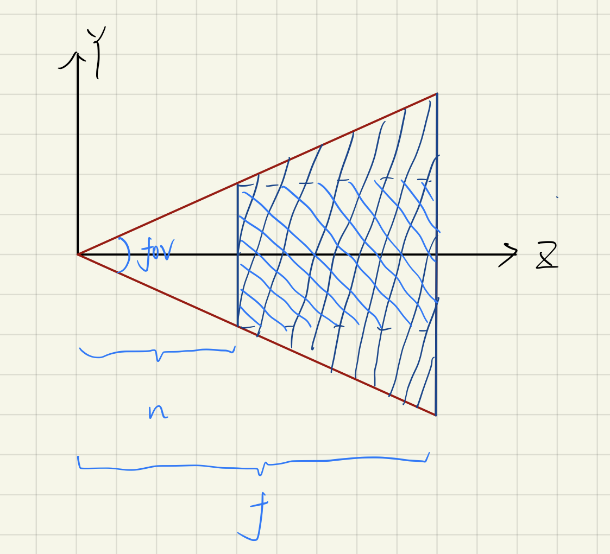

# Perspective Part.2

There are hosts of references that use `fov, aspect, far, near` to discribe the **Perspective Projection Matrix**.

The four parameters represent respectively:

> fov: field of view
> 
> aspect: aspect ratio
> 
> far: far plane
> 
> near: near plane

Here we use the vertical FOV, and transform those to previous parameters, `t, b, l, r, n, f`.

$$
\left\{\begin{matrix}
n = near\\
f = far
\end{matrix}\right.
$$

$$
\left\{\begin{matrix}
t = n \times \tan{\frac{fov}{2}}\\
b = -n \times \tan{\frac{fov}{2}}
\end{matrix}\right.
$$

$$
\left\{\begin{matrix}
r = aspect \times n \times \tan{\frac{fov}{2}}\\
l = -aspect \times n \times \tan{\frac{fov}{2}}
\end{matrix}\right.
$$

Eventually, the previous formula is transformed into:

$$
\begin{pmatrix}
\frac{\cot{\frac{for}{2}}}{aspect \cdot n} & 0 & 0 & 0\\
0 & \frac{\cot{\frac{for}{2}}}{near} & 0 & 0\\
0 & 0 & \frac{2}{near-far} & 0\\
0 & 0 & 0 & 1
\end{pmatrix}\times
\begin{pmatrix}
1 & 0 & 0 & 0\\
0 & 1 & 0 & 0\\
0 & 0 & 1 & -\frac{near+far}{2}\\
0 & 0 & 0 & 1
\end{pmatrix}\times
\begin{pmatrix}
near & 0 & 0 & 0\\
0 & near & 0 & 0\\
0 & 0 & near+far & -near*far\\
0 & 0 & 1 & 0
\end{pmatrix}\\
=\begin{pmatrix}
\frac{\cot{\frac{for}{2}}}{aspect} & 0 & 0 & 0\\
0 & \cot{\frac{fov}{2}} & 0 & 0\\
0 & 0 & \frac{near+far}{near-far} & -\frac{2\cdot near \cdot far}{near - far}\\
0 & 0 & 1 & 0
\end{pmatrix}
$$
